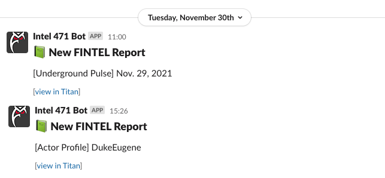
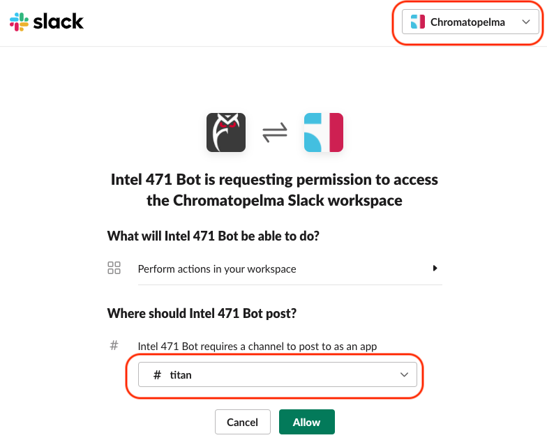
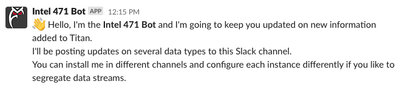
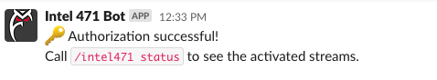
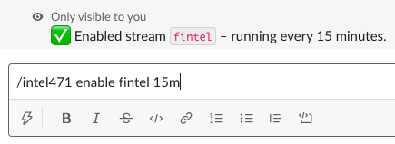

# Intel 471's Titan + Slack Integration

Titan delivers structured technical and non-technical data and intelligence that is continually updated by Intel 471's global team and automated processes.

With this integration you'll stay updated on what's going on in Titan without leaving Slack. The updates will be delivered right to the channel of your choice.

## Table of Contents
- [Get started](#get-started)
  - [Requirements](#requirements)
  - [Installation](#installation)
  - [Authorization](#authorization)
  - [Uninstalling](#uninstalling)
- [Interacting with the bot](#interacting-with-the-bot) 
- [Available streams](#available-streams)
- [Feedback](#feedback)
--------
## Get started
### Requirements

Titan API credentials.

### Installation

You can go to Slack App Directory and search for **Intel 471 Bot** app or you can install it directly from [here](https://messagingbot.intel471.com/slack).

After clicking **Add to Slack** button you'll be redirected to Slack's installation page where you choose the workspace (upper-right corner) and the channel where you want to install the bot to.

 
Upon installation, a welcome message with short manual and basic information will be sent to the chosen channel. 

Please note that adding the app to the channel through *Integrations* tab in channel's details is not enough as it does not generate necessary webhook and backend objects. In order to add it to another channel please repeat the procedure explained above.

### Authorization
At this point the bot is installed but is not authorized yet. Authorization is required so the bot can access the Titan data on your behalf. Click on the **Intel 471 bot auth page** link provided in the welcome message and provide your Titan credentials.

 Once completed, all supported streams with default intervals will be activated. The
 bot is now all set and you will start seeing the updates shortly after they appear in Titan.

 

### Uninstalling

| Scope | How to uninstall |
|-----|----|
| Channel | Click on the **Intel 471 bot** name in one of the messages from it -> Go to App -> Configuration -> Click on *Revoke* next to the channel of your choice.  |
| Whole workspace | Click on the **Intel 471 bot** name in one of the messages from it -> Go to App -> Configuration -> Remove App. It can be done only by a person who installed the app or by the admin.   |

Please note that it is not enough to remove the app from *Integrations* tab in channel's details.

## Interacting with the bot

You can send the bot slash commands in order to see its status and to configure the streams. Each command must start with `/intel471`.

`/intel471 help` - Shows help information.

`/intel471 status` - Shows the list of active and inactive streams in your channel and information regarding the installed instance.

`/intel471 enable stream interval [options]` - Enables or reschedules the specified stream. The first argument is the name of the stream. The second argument is the interval, which can be provided in several formats: every several minutes (e.g., `15m`), every several hours (e.g., `2h`) or every day at a specific time UTC (e.g., `14:30`). The following arguments are optional and specific to the selected stream. Example: `/intel471 enable fintel 15m`.

`/intel471 disable stream [options]` - Disables selected stream or removes options from the stream. You can turn the stream back on at any time using the enable command. Example: `/intel471 disable fintel`.

`/intel471 watchers` - Shows the list of the logged-in user’s Watcher groups defined in Titan.

## Available streams

- `fintel` - Finished Intelligence - key insights from Intel 471 field reporting, raw underground content, open sources and more.
- `malware` - Technical updates of malware families and adversaries.
- `news` - Latest announcements and blog posts.
- `reports` - Detailed reports based on tactical observations of cybercriminal activity enhanced with our assessment of credibility and reliability.
- `sitrep` - Summary status reports of an ongoing situation or activity monitored by Intel 471.
- `spotrep` - Brief summaries used to communicate timely intelligence or status changes for significant events.
- `alerts` - Alerts matching search criteria defined in Titan’s Watchers for the logged-in user. This stream accepts the following optional arguments:
    * `ignoreRead` - Do not show alerts marked as read. Show all by default
    * `markAsRead` - Mark alerts posted to the channel as read. Do not mark by default.
    * `<watcher-group-uid>` - One or more unique identifiers (UIDs) of Watcher groups to narrow down the stream. The UIDs can be obtained from the `watchers` command. Example showing the full command to subscribe to only unread alerts from two selected Watcher groups and continue to mark them as read: `/intel471 enable alerts 10m ignoreRead markAsRead 7fbb148b-e59f... e59f4798-9634...`

## Feedback

Please send an email to support/intel471.com to request a feature or report a problem.
